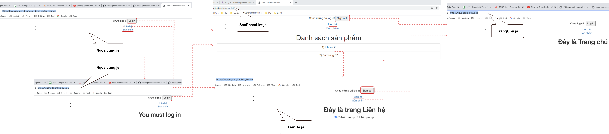
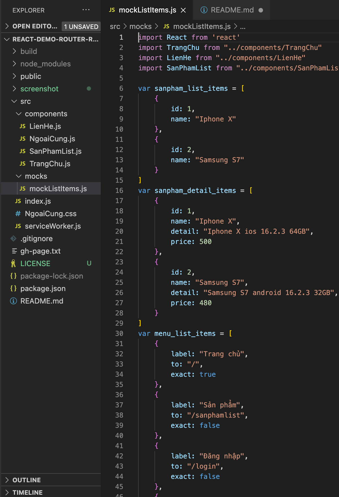

# react-demo-router-redirect 🐳




## Run

```
1) npm install
2) npm start
```

## Note

- NgoaiCung.js: // component `LoginX` call hàm onAuthen() of sibling component `AuthenButton`

## DB
- `src/mocks/mockListItems.js`

